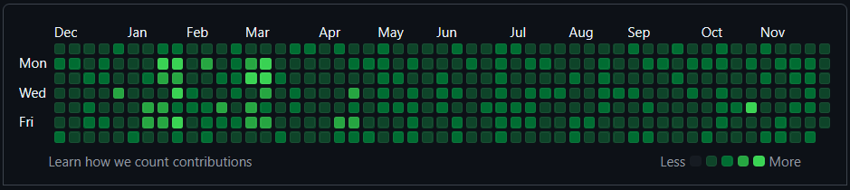

# GitHub Contribution Graph / Heatmap Generator

This Python script automates the process of generating commits on GitHub to create a heatmap of activity on your profile.

## Demo



#### Features

- Creates a new private GitHub repository (if the one specified does not already exist).
- Generates a series of commits on specified days, from a given start date, simulating daily GitHub activity.
- The script pushes all the commits to GitHub using the Git and GitHub CLI.

## Prerequisites

To run this script, you need to have the following tools installed and accessible in your system's PATH:

- `git`: Version control system used to track changes.
- `gh` : GitHub's command-line tool for interacting with GitHub.
- Python 3.6 or later

You can download and install these tools from the following links:
- [Git](https://git-scm.com/downloads)  
- [Github CLI](https://cli.github.com/)
- [Python](https://www.python.org/downloads/)


## Installation

1. Clone the repository containing the script:

   ```bash
   git clone https://github.com/ok-omar/contribution-graph-heater.git

2. Navigate to the project directory:

    ```bash
    cd contribution-graph-heater

3. Ensure that gh is authenticated:

    ```bash
    gh auth login

## Usage

#### Command-Line Arguments

- `--username`: Your GitHub username.
- `--repo`: The name of the GitHub repository to create.
- `--days`: Number of days to generate commits for (default is 180 days).
- `--weekdays`: Number of weekdays on which commits will be made (default is 7)

#### Example

   ```bash
python heat.py --username ok-omar --repo heated --days 360 --weekdays 5
   ```


#### This command will:

- Create a repository called `heated` if it doesn't already exist.
- Generate commits for the past 360 days, limited to weekdays (Monday to Friday).
- Push all the generated commits to the main branch of the GitHub repository `ok-omar/heated`.

#### How It Works:

- **Create Directory and Repository**: The script first creates a new directory for the repository and initializes a Git repository. If the GitHub repository does not exist, it is created using the GitHub CLI (gh repo create).

- **Generate Commits**: Commits are generated for the specified number of days, The script randomly selects a commit intensity (the number of commits made on a given day) from a predefined set of ranges for each day.

- **Push Commits to GitHub**: After all commits are made locally, the script pushes them to the specified GitHub repository.


⚠️   Do **NOT** use the name of an existing repository that contains any files or data. The script performs a **force push**, which will **overwrite and delete all existing content** in the specified repository.

   To avoid data loss, either:

   1. Use the name of an **empty repository**, or  
   2. Provide a new repository name, and the script will create it automatically for you.

Always double-check the repository name before running the script!


## Error Handling

- If the Git or GitHub CLI is missing, the script will notify you and stop execution.
- If pushing the commits fails, an error message will be displayed, advising you to ensure the repository exists and you have the correct permissions.

## Troubleshooting

If you encounter issues, make sure:

- `gh` is authenticated, run `gh auth login`
- The necessary tools (`Python`, `git` and `gh`) are installed and in the system PATH.

## License

This project is licensed under the MIT License
